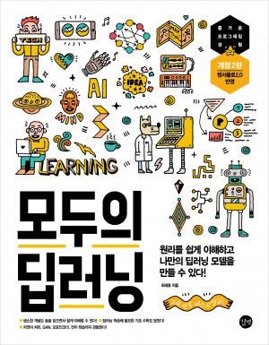
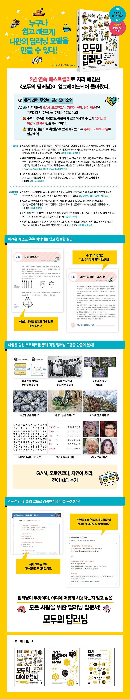

# 『모두의 딥러닝 <개정2판>』

<h3>딥러닝 기초부터 최신 트렌드까지 한권에</h3>

복잡한 수식은 최대한 걷어내고 기본 동작 원리 → 딥러닝 이론 → 딥러닝 활용 → 심화까지 단계별로 학습할 수 있게 구성했으며, 실전 프로젝트를 통해 다양한 딥러닝 모델을 구현해 볼 수 있습니다. CNN, RNN은 물론 초판에서 다루지 않았던 GAN, 오토인코더, 자연어 처리, 전이 학습 등 새로운 내용을 수록하였고, 딥러닝을 공부하면서 나오는 수식을 좀 더 수월하게 이해할 수 있도록 기초 수학편을 추가했습니다. 

* 👉[정오표](https://taehojo.github.io/book/errata-20220111.pdf)
* 자세한 책 소개 및 구매: [예스24](http://www.yes24.com/Product/Goods/86611190), [교보문고](http://www.kyobobook.co.kr/product/detailViewKor.laf?mallGb=KOR&ejkGb=KOR&linkClass=&barcode=9791165210397), [인터파크](http://book.interpark.com/product/BookDisplay.do?_method=detail&sc.prdNo=327029899)

## 소스 코드 실행 방법
   * 1장 나의 첫 딥러닝 
      + 딥러닝 작업환경 만들기 (20~27페이지) 참조

## 상세 안내

